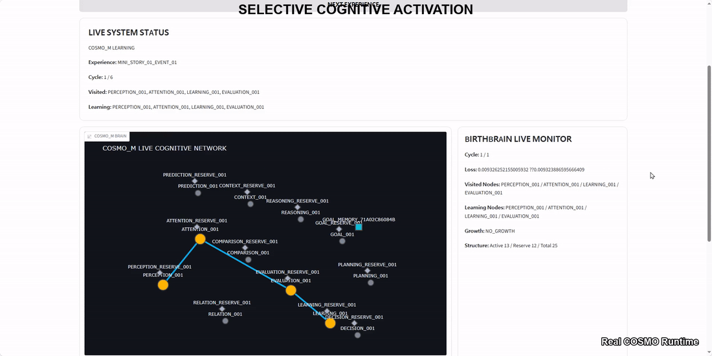

# COSMO

### An AI Brain That Learns and Grows Through Experience

**Start Small. Learn Continuously. Grow Smarter. Stay Efficient.**

COSMO is an experimental AI brain designed to learn continuously from experience, preserve prior knowledge, selectively activate cognitive functions, and grow its internal structure when needed.

---

## Dynamic Cognitive Network



*Real COSMO runtime visualization generated from actual visited nodes, learning nodes, and signal propagation during execution.*

---

## Verified Snapshot

| Evidence | Result |
|---|---|
| Continual Concept Learning | **1 COSMO → 1,000 concepts** |
| Early / Middle / Late Retention | **1.0 / 1.0 / 1.0** |
| Stability | **PASS** |
| Plasticity | **PASS** |
| Held-out Knowledge Transfer | **PASS** |
| Restart Continuity | **PASS** |
| Structural Growth | **PASS** |
| Current Brain Package | **323.212 MB** |

> **323.212 MB is the complete persistent COSMO brain package—not model weights alone.**  
> It includes neural structure, persistent memory, memory index, representation, and other persistent brain state.

---

## Why COSMO Started

Large language models have demonstrated remarkable capabilities, but their use also raises fundamental questions:

- Can an AI preserve useful knowledge and experience across time?
- Can it continue learning without repeatedly losing what it already knows?
- Must useful intelligence begin with a very large pretrained model?
- Could an AI begin with a relatively small cognitive structure and develop through experience?

Human intelligence does not begin fully formed. We learn, remember, compare, adapt, and develop over time.

COSMO began from a simple question:

> **Must intelligence start large?**

COSMO explores another possibility: begin with a relatively small cognitive structure, learn continuously from experience, preserve useful knowledge, selectively use cognitive functions, and grow when additional capacity is needed.

COSMO is not presented as AGI. It is an experimental system investigating whether developmental and continual-learning principles can provide another path toward increasingly capable AI systems.

---

## A Different Starting Point

| | Large Pretrained AI | COSMO Research Direction |
|---|---|---|
| Starting point | Large-scale pretrained capability | Relatively small initial cognitive structure |
| New knowledge | Primarily training / context / external retrieval | Continued experience-driven learning |
| Memory | Often external or context-dependent | Persistent memory integrated into the brain system |
| Cognitive execution | Large model execution | Selective cognitive activation |
| Structural change | Usually fixed after deployment | Structural growth when required |
| Core question | How capable can a pretrained model become? | How capable can a learning brain become over time? |

This is a **general design comparison**, not an absolute characterization of every LLM or AI architecture, and does not claim that one approach is universally superior.

> **What if useful AI capability could be accumulated instead of installed upfront?**

---

## Unknown Action Experiment

One of COSMO's key experiments began with an action token it did not know:

### `SHAKES`

Instead of defining its meaning directly, COSMO was exposed to repeated experiences containing the unresolved action.

```text
Unknown Action
      ↓
Repeated Experience
      ↓
Evidence Accumulation
      ↓
New Action Concept
      ↓
Persistent Memory
      ↓
Later Recognition
      ↓
Held-out Reuse
```

The final experiment confirmed:

- Novel action concept formation: **PASS**
- Persistent action concept: **PASS**
- Later recognition: **PASS**
- Held-out state transformation: **PASS**
- Target leakage: **0.0**
- Held-out knowledge transfer: **PASS**

`SHAKES` is an experimental token used in a controlled research micro-environment.

The result demonstrates formation and reuse of learned internal action knowledge within that setting; it does **not** establish broad natural-language understanding.

---

## Selective Cognitive Activation

COSMO does not activate every cognitive region for every experience.

Evidence from the current experience determines which available cognitive functions participate in the runtime path, including functions such as:

**Perception · Attention · Context · Prediction · Evaluation · Learning · Reasoning**

Verified experiments showed smaller cognitive routes for simpler experiences and additional participation from regions such as **Context**, **Prediction**, or **Reasoning** when relevant processing was demanded.

The Dynamic Cognitive Network above is generated from actual runtime execution data rather than a predefined animation.

> **Not every available cognitive function is activated. COSMO selectively uses cognitive regions according to the demands detected from the current experience.**

---

## Structural Growth

Selective activation determines which existing resources participate. Structural Growth addresses what happens when additional capacity is required.

A verified experiment produced:

```text
Repeated Functional Demand
        ↓
Capacity Pressure
        ↓
Growth Condition
        ↓
LOCAL_GROWTH
        ↓
ATTENTION_RESERVE_001 Activated
        ↓
New Node Participates in Runtime
```

Verified result:

- Growth decision: **LOCAL_GROWTH**
- Growth reason: **REGION_CAPACITY_EXHAUSTED**
- Target region: **ATTENTION**
- Reserve node activation: **PASS**
- New node participation: **PASS**

This demonstrates structural expansion of an existing cognitive region under the tested conditions. It does **not** mean COSMO autonomously invented an entirely new cognitive function.

### Two Forms of Growth

**Structural Growth**  
Expansion of available cognitive structure when additional capacity is required.

**Qualitative Growth**  
Development of increasingly capable cognitive processing through learning and integration of cognitive functions.

The longer-term direction is not simply **more nodes**, but:

> **better cognition + necessary structural growth**

---

## Persistent Memory & Restart Continuity

COSMO treats memory as part of the persistent cognitive system rather than temporary runtime context alone.

Verified experiments include:

- Internal memory persistence: **PASS**
- External memory offload / recall / reinjection: **PASS**
- Structural checkpoint restore: **PASS**
- Memory availability after restart: **PASS**
- New learning after restore: **PASS**
- New memory continuity after another restart: **PASS**
- Stability after restore: **PASS**
- Plasticity after restore: **PASS**

```text
Learn → Save → Restart → Restore
                     ↓
              Continue Learning
                     ↓
                 Save Again
                     ↓
               Fresh Restore
                     ↓
          Old + New Knowledge
```

> **Learning should continue across restarts without requiring the brain to begin again from zero.**

---

## 1,000-Concept Continual Learning

A single continuing COSMO instance was tested through **1,000 concepts**.

| Metric | Result |
|---|---:|
| COSMO instances | **1** |
| Concepts formed | **1,000 / 1,000** |
| Early retention | **1.0** |
| Middle retention | **1.0** |
| Late retention | **1.0** |
| Stability | **PASS** |
| Plasticity | **PASS** |
| Final test status | **PASS** |

This demonstrates cumulative learning and retention under the tested experimental workload.

It does **not** establish unlimited learning capacity or real-world long-term stability.

---

## Beyond Static Concepts

COSMO is not intended to learn only isolated object concepts.

Verified experimental areas include:

| Learning / Cognitive Area | Status |
|---|---|
| Concept Learning | **PASS** |
| Relation Learning | **PASS** |
| Action → Event | **PASS** |
| Temporal Sequence | **PASS** |
| Repeated Transition Pattern | **PASS** |
| Action → Result Association | **PASS** |
| Causal Evidence | **PASS** |
| Context Processing | **PASS** |
| Prediction Processing | **PASS** |
| Basic Reasoning | **PASS** |
| Goal Processing | **PASS** |
| Decision Processing | **PASS** |
| Grounded Language Reuse | **PASS** |

The developmental direction extends beyond static labels:

```text
Features → Comparison → Concept → Relation
                         ↓
                  Actor / Action
                         ↓
                       Event
                         ↓
                  Change / Time
                         ↓
                      Context
                         ↓
                    Prediction
                         ↓
                    Reasoning
                         ↓
             Goal / Planning / Decision
                         ↓
                     Language
```

These cognitive functions were not all autonomously invented by COSMO. They were implemented and tested before integration; experiences can then produce evidence and demand that selectively activate relevant functions during actual execution and learning.

The broader research question is:

> **Can one persistent learning system gradually integrate increasingly diverse forms of experience and cognitive processing?**

---

## Grounded Language

COSMO also connects language with previously learned internal knowledge.

In verified experiments, the learned `SHAKES` action concept could later be recognized, grounded through language, and reused in a held-out situation.

```text
Language Input
      ↓
Learned Internal Knowledge
      ↓
Grounding
      ↓
Reuse
```

This demonstrates **grounded reuse of learned internal knowledge in the tested environment**, not broad natural-language understanding or general language intelligence.

---

## Cognitive Footprint

### **323.212 MB**

This is the measured size of the current persistent `COSMO_M` brain package—not model weights alone.

It includes:

**Neural Structure · Persistent Memory · Memory Index · Representation · Persistent Brain State**

The measurement does **not** by itself demonstrate greater efficiency than LLMs or other AI architectures.

COSMO's goal is not to remain permanently small, but to pursue efficient growth relative to acquired capability.

> **Start Small. Learn Continuously. Grow Smarter. Stay Efficient.**

---

## Target Environments

Potential future environments include:

- On-Device AI
- Edge AI
- Personal Persistent AI
- Robotics / Embodied AI
- Autonomous Systems

These are **target environments, not currently validated deployment claims.**

---

## Current Stage & Limitations

COSMO is an **experimental research system**, not a finished general-purpose AI product.

Current evidence does **not** establish:

- AGI or general intelligence
- Broad natural-language understanding
- Unlimited continual learning
- Human-level cognition
- Real-world long-term stability
- Production readiness across the target environments

COSMO distinguishes between:

> **Implemented → Tested → Verified → Long-term Validated**

These are not treated as equivalent claims.

---

## Development Direction

Current research directions include:

- more diverse and complex experiences,
- longer-term continual learning,
- deeper memory–cognition integration,
- qualitative development of cognitive capabilities,
- structural growth when additional capacity is required,
- efficient Cognitive Footprint as capability increases.

> **Start Small. Learn Continuously. Grow Smarter. Stay Efficient.**

---

## Evidence

COSMO's public claims are based on executed experiments and recorded runtime results.

> **Results First. Direction Visible. Mechanism Protected. Claims Evidence-Bounded.**

Detailed internal mechanisms, thresholds, growth policies, and implementation logic are not included in this public repository.

Additional experiment summaries and selected evidence may be published progressively.

---

## Business & Collaboration

COSMO is independently developed and open to discussions regarding:

- **Investment**
- **Technology Licensing**
- **Technology Transfer / Sale**
- **Acquisition**
- **Strategic Partnership & Commercialization**

Technical due diligence or focused proof-of-concept validation can be discussed with serious interested parties.

### Contact

For business, investment, research, or strategic collaboration inquiries, please use the contact information provided through this GitHub account.

---

## Project Status

**Experimental Research System — Active Development**

COSMO is not presented as AGI or a finished commercial product.

Its current purpose is to experimentally investigate whether an AI system can begin from a relatively small cognitive structure and progressively **learn, remember, adapt, and grow through experience**.
